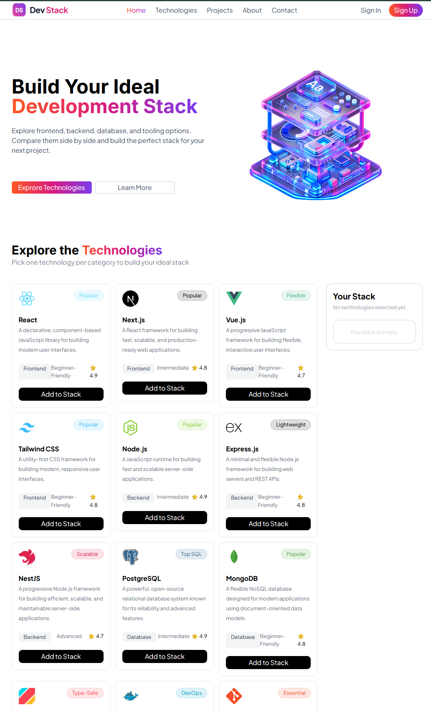

# 🚀 Dev Stack

Dev Stack is a single-page React application that helps developers explore modern web development technologies. Users can explore different frontend, backend, database, and tooling technologies with their descriptions, difficulty levels, ratings, and categories, and build their own personalized development stack.

## 🌐 Live Demo

🔗 **Live Website:** https://dev-stack-2026.netlify.app/

🔗 **GitHub Repository:** https://github.com/minhajulmohit/DEVSTACK

---

## 📸 Screenshot




---

## 🛠️ Technologies Used

* React.js
* TypeScript
* Tailwind CSS
* Vite
* JSON
* React Toastify

---

## ✨ Main Features

* 🔍 Explore modern web development technologies
* 🖥️ Browse Frontend, Backend, Database, and Tooling technologies
* ⭐ View technology ratings
* 📊 View technology difficulty levels
* 🏷️ View technology categories and badges
* ➕ Add technologies to your personalized stack
* ❌ Remove individual technologies from your stack
* 🗑️ Remove all selected technologies at once
* 🔔 Toast notifications when technologies are added or removed
* 📱 Responsive design for different screen sizes
* 🎨 Modern gradient-based user interface
* 🍔 Responsive mobile navigation menu

---

## 📦 Dependencies

### Main Dependencies

* `react`
* `react-dom`
* `react-toastify`
* `tailwindcss`
* `@tailwindcss/vite`

### Development Dependencies

* `typescript`
* `vite`
* `@vitejs/plugin-react`
* `@types/react`
* `@types/react-dom`
* `@types/node`
* `oxlint`

---

## 💻 Run the Project Locally

Follow these steps to run the project on your local machine.

### 1. Clone the repository

```bash
git clone https://github.com/minhajulmohit/DEVSTACK.git
```

### 2. Go to the project directory

```bash
cd DevStack
```

### 3. Install dependencies

```bash
npm install
```

### 4. Start the development server

```bash
npm run dev
```

The application will be available at the local URL provided by Vite, usually:

```text
http://localhost:5173
```

---

## 🏗️ Build for Production

To create a production build:

```bash
npm run build
```

To preview the production build locally:

```bash
npm run preview
```

---

## 📁 Project Structure

```text
DevStack/
│
├── public/
│   └── Data.json
│
├── src/
│   ├── assets/
│   ├── Components/
│   │   ├── Cards/
│   │   │   ├── Explore.tsx
│   │   │   └── YourStack.tsx
│   │   ├── Footer.tsx
│   │   ├── Hero.tsx
│   │   ├── Nav.tsx
│   │   ├── TechHeader.tsx
│   │   └── TechSection.tsx
│   │
│   ├── App.tsx
│   ├── Types.ts
│   ├── index.css
│   └── main.tsx
│
├── index.html
├── package.json
├── tsconfig.json
└── README.md
```

---

## 🔗 Relevant Links

* 🌐 **Live Demo:** [https://dev-stack-2026.netlify.app/]
* 💻 **GitHub Repository:** https://github.com/minhajulmohit/DevStack


---

## 👨‍💻 Author

**MD Minhajul Islam Mohit**

Full Stack AI Web Development Student

* GitHub: https://github.com/minhajulmohit
* LinkedIn: https://www.linkedin.com/in/md-minhajul-islam-mohit-856261439/
